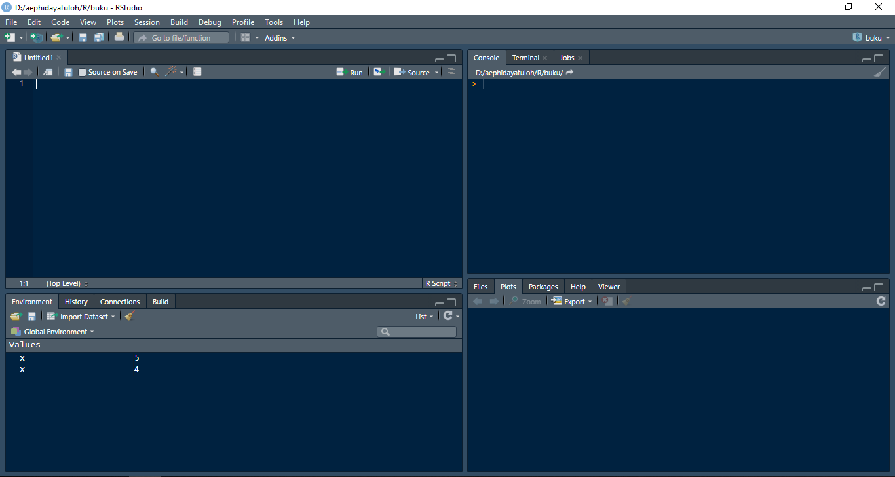
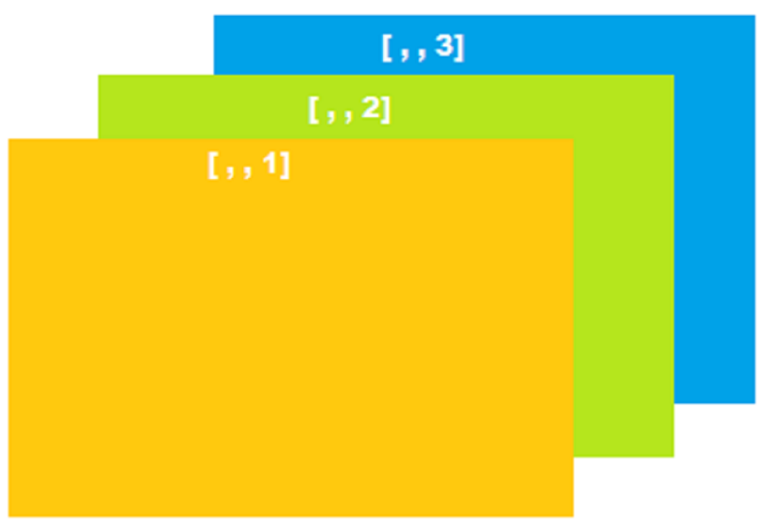

---
output:
  word_document: default
  html_document: default
---
# Pengantar R {#intro}

## Kenapa Memilih R?

R adalah sebuah program komputasi statistika dan grafis [@R-base]. Saat ini R sudah dikenal luas sebagai salah satu *powerful software* untuk analisis data dan *Data Science*. Tentu saja selain R masih banyak *software* lain yang tidak kalah dengan R, misalnya Python. Berikut ini beberapa hal diantara kelebihan R. R dibuat dengan tujuan awal untuk komputasi statistika dan grafis. Awalnya digunakan oleh para ilmuwan dalam riset mereka dan para akademisi. 

* Gratis dan Open Source
* Tersedia banyak sekali package yang dapat digunakan
* Dibuat oleh statistisi untuk statistisi
* Mudah dalam melakukan transformasi dan _processing_ data
* Mempunyai package `ggplot2` yang mampu menghasilkan grafik yang sangat bagus
* Membuat *Reproducible report* dengan RMarkdown
* Dapat membuat aplikasi interaktif berbasis web (shiny & flexdashboard), dan masih banyak lagi.

### Download dan Install R

Di PC dengan OS Windows dapat melakukan langkah-langkah berikut untuk install R.

1. Buka halaman <https://cran.r-project.org>
2. Pilih *Download R for Windows*
3. Klik *Install R for the first time*
4. Kemudian klik *Download R x.x.x for Windows*
5. Simpan file installer tersebut dan tunggu hingga proses download selesai
6. Setelah download selesai, jalankan file R x.x.x.exe tersebut dan hanya perlu *Next* dan *Finish*

catatan: mungkin Anda hanya perlu memilih untuk install versi 64bit jika OS Windows Anda adalah 64bit. 

### Menjalankan R

Setelah selesai install, Anda perlu membuka R GUI.

1. Pada Windows 10, klik atau tekan tombol *Start*
2. Cari Folder **R** dan pilih R sesuai versi yang sudah terinstall

Di bawah ini adalah tampilan ketika Anda membuka program R GUI.

```{r echo=FALSE, fig.cap='R GUI', fig.align='center'}
knitr::include_graphics("RGUI.png")
```

Anda sudah dapat menggunakan R melalui R GUI ini. Namun Anda juga dapat menggunakan _Integrated Development Environment_ (IDE) untuk lebih nyaman, mudah dan efisien ketika bekerja dengan R. IDE untuk R yang saat ini sangat sering digunakan adalah [RStudio](https://rstudio.com). Berikut ini adalah cara untuk install RStudio di PC Windows.

## RStudio

Sebelum membahas lebih lanjut tentang R, sebaiknya Anda download dan install [RStudio](https://www.rstudio.com/products/rstudio/download/) terlebih dahulu. RStudio adalah *Integrated Development Environment* (IDE) yang banyak digunakan hingga saat ini. Dapat dikatakan bahwa hampir semua pengguna R yang sudah mengetahui RStudio akan lebih memilih menggunakan R melalui RStudio dibandingkan dengan menggunakan R GUI. 

Download RStudio versi desktop sesuai dengan kebutuhan Anda. Sangat disarankan untuk menggunakan RStudio versi terbaru, termasuk dengan R. R dan RStudio adalah dua program yang berbeda. Anda tidak harus install R untuk dapat menggunakan program R. Tapi Anda diwajibkan untuk install R terlebih dahulu sebelum install dan menggunkan RStudio. RStudio membutuhkan program R yang sudah terinstall di PC atau server.

Install RStudio dengan cara berikut.

* Download RStudio Desktop (https://www.rstudio.com/products/rstudio/download/)
* Jalankan installer yang sudah didownload
* Klik Next 
```{r echo=FALSE, fig.align='center', fig.cap='Install: Langkah 1', fig.height=15, fig.width=15}
knitr::include_graphics("install1.png")
```

* Klik Next 
```{r echo=FALSE, fig.align='center', fig.cap='Install: Langkah 2', fig.height=15, fig.width=15}
knitr::include_graphics("install2.png")
```

* Klik Next 
```{r echo=FALSE, fig.align='center', fig.cap='Install: Langkah 3', fig.height=15, fig.width=15}
knitr::include_graphics("install2.png")
```

```{r echo=FALSE, fig.align='center', fig.cap='Tampilan RStudio', fig.height=8, fig.width=8}

```

## Dasar Pemrograman R

Hal yang paling sederhana yang dapat dilakukan R adalah sebagai kalkulator. Coba Anda ketikan perintah di bawah ini pada console R dan tekan tombol Enter setelah selesai. 

```{r eval=FALSE}
2 + 4
```
Akan muncul hasil `[1] 6`. Hasil `[1]` menunjukkan bahwa yang ditampilkan adalah dari elemen pertama. Hal ini akan dibahas di bagian \@ref(vector).

Tanda `>` adalah prompt yang menunjukkan bahwa R sedang dalam posisi siap menerima perintah baru. Jika perintah belum lengkap maka akan berganti menjadi tanda `+`. Artinya ada perintah atau bagian script yang belum selesai.

```{r eval=FALSE}
> 2 +
+
```
Perhatikan setelah Anda tekan tombol Enter maka kursor di R yang sebelumnya `>` berganti `+` yang menandakan bahwa perintah belum lengkap. Maka jika Anda kembali menuliskan bilangan lain, misalkan `4` dan tekan tombol Enter maka prompt di R akan kembali menjadi `>` setelah menuliskan hasilnya karena perintah sudah lengkap dan selesai.

```{r}
print("Hello World!")
```

R adalah bahasa pemrograman yang *case-sensitive*. Artinya perbedaan huruf kapital dan huruf kecil sangat berpengaruh.

```{r eval=FALSE}
a <- 3
a
## [1] 3
```
```{r eval=FALSE}
A
## Error: object 'A' not found
```


### *Assignment*

Operator *assignment* di R umumnya menggunakan `<-`.

```{r}
x <- 5
x
```

| Operator *Assignment* | Penjelasan |
|---------|--------------------------|
| `<-` | nilai dari sebelah kanan dimasukkan ke dalam objek di sebelah kiri (dapat juga menggunakan `=`). |
| `->` | nilai dari sebelah kiri dimasukkan ke dalam objek di sebelah kanan. |
| `<<-` | nilai dari sebelah kanan dimasukkan ke dalam objek global di sebelah kiri. |
| `->>` | nilai dari sebelah kiri dimasukkan ke dalam objek global di sebelah kanan. |

Karena R adalah bahasa pemrograman yang *Case Sensitive*, jadi untuk penulisan nama objek atau nilai berupa karakter sangat tergantung dari kapitalisasinya.

```{r}
x <- 5
x
X <- 4
X
x <- 8
x
```

Ketika menggunakan R, setiap yang ada di R disebut objek. Jenis-jenis objek dasar yang ada di R adalah vector, factor, matriks, array, data.frame, list dan function.

### Vector {#vector}

Vector\index{vector} adalah objek paling sederhana yang ada di dalam R. Secara umum jenis data terbagi 2, yaitu numeric dan character. Ada berbagai cara untuk membuat sebuah vector di R.

1. Fungsi `c()`

Fungsi yang paling sering digunakan untuk membuat sebuah  vector adalah dengan menggunakan fungsi `c()`.

```{r}
x <- c(2, 1, 5, 3, 1)
x
```

Pada script di atas, dibuat sebuah objek `x` berupa vector numeric. setiap elemen dipisah menggunakan tanda koma (`,`).

2. Tanda colon (`:`)

Untuk membuat sebuah vector numeric berurutan secara meningkat atau menurun. Lihat contoh berikut ini.

```{r}
# membuat vector numeric dengan nilai dari 1 s/d 10 secara meningkat 1
x <- 1:10 # 1 sampai 10
x
```

```{r}
# membuat vector numeric dengan nilai dari 10 s/d 10 secara menurun 1
x <- 10:-10 # 10 sampai -10
x
```

3. Fungsi `seq()`

Membuat vector berurutan dan dengan *increment* tertentu.

```{r}
x <- seq(from = 1, to = 10) # 1 sampai 10 dengan increment 1 (default by = 1)
x
x <- seq(from = 1, to = 20, by = 2) # 1 sampai 20 dengan increment 2
x
x <- seq(from = 1, to = 10, length.out = 7) # 1 sampai 10, sebanyak 7 elemen, increment mengikuti
x
x <- seq(from = 1, to = 10, along.with = 1:4) # 1 sampai 10, sebanyak elemen dari vector lain
x
```

4. Mengambil satu kolom dari data.frame

Mengambil sebuah kolom dari sebuah data.frame akan dibahas lebih jauh di bagian data.frame (bagian \@ref(dataframe)). Dengan menggunakan tanda dolar `$` dan diikuti dengan nama kolom yang akan diambil dari data.frame tersebut.

```{r}
mtcars$mpg
```

> Dari data.frame `mtcars` diambil kolom `mpg`


5. Fungsi `unlist()`

Fungsi ini berguna untuk menjadikan sebuah objek list menjadi sebuah vector. Pembahasan lebih lanjut akan dibahas di bagian \@ref(list).

```{r}
x <- list(mtcars$mpg, mtcars$disp)
x
x <- unlist(x)
x
```

Fungsi `unlist()` menggabungkan semua `list` menjadi sebuah vector.

**Catatan penting untuk vector**: walaupun ditampilkan ke samping, dimensi vector di R sebenarnya ke bawah. Bayangkan untuk sebuah vector seperti satu kolom di Ms Excel.

Semua contoh di atas untuk membuat vector adalah vector numeric. Vector numeric adalah vector yang semua elemennya bernilai dan bertipe numerik. 

#### Vector Character

Vector character adalah vector yang semua elemennya bertipe character. 

```{r}
y <- c("a", "A", "d", "c")
y
```

Jika ketika membuat sebuah vector bernilai numerik namun ada satu saja elemennya bertipe character maka semua elemennya akan bertipe character.

```{r}
c(1, 2, 3, 5, "a")
```

Di R ada 2 buah vector khusus yang bertipe character, yaitu `letters` dan `LETTERS`. 
```{r}
letters
LETTERS
```

Dua buah vector atau lebih dapat digabungkan dengan fungsi `c()`. Namun, jika salah satu vector bertipe character, maka vector hasil gabungan akan menjadi vector character.

```{r}
c(x, y)
```

### Factor

Factor\index{factor} merupakan bentuk lebih luas dari vector. Biasanya factor lebih sering digunakan untuk menyimpan data nominal atau ordinal. Misalnya vector character yang berisi `"male"` dan `"female"`. Pada vector character, nilainya adalah `"male"` dan `"female"` seperti terlihat apa adanya. Namun pada factor, tampilan dari isi datanya mungkin `"male"` dan `"female"` tetapi isi dari factor adalah pengkodean numerik. Misal untuk `"female"` nilai sebenarnya adalah `1`, sedangkan `"male"` berniali `2`. 

```{r}
fc <- factor(c("SD", "SMA", "SMP", "SMP", "SD", "SMA", "SD", "SMP"))
fc
```

Nilai sebenarnya dari factor tersebut adalah

```{r}
print.default(fc)
```

Factor mempunyai level, secara default levelnya adalah berdasarkan urutan alfabet. Untuk merubah level dari sebuah factor, gunakan argumen `levels =`.

```{r}
factor(fc, levels = c("SD", "SMP", "SMA"))
```


### Matriks

Matriks\index{matriks} adalah objek di R yang memiliki 2 dimensi, baris (*row*) dan kolom (*column*), dan tipe nilainya sama. Jika ketika membuat sebuah matriks elemennya memiliki minimal 1 elemen bertipe character maka seluruh matriks tersebut akan bertipe character. Membuat matriks di R menggunakan vector yang dikonversi dimensinya.

```{r}
x <- mtcars$mpg # vector
length(x) 
```

Karena vector `x` memmiliki 64 elemen, maka dimensi matriks yang dapat dibuat adalah 2 angka yang hasil perkaliannya menghasilkan nilai 32. Salah satunya adalah `8 x 4 = 32`.

```{r}
m <- matrix(data = x, nrow = 8, ncol = 4, byrow = TRUE)
m
```

Matriks `m` adalah matriks berukuran 8x4. Argumen `byrow = TRUE` artinya matriks akan setiap elemen `x` diisikan ke `m` memenuhi baris terlebih dahulu. Jika `byrow = FALSE` maka setiap elemen `x` diisikan ke `m` memenuhi kolom terlebih dahulu.

Untuk membuat matriks dengan nilai yang sama seluruhnya, maka dapat dilakukan seperti berikut.

```{r}
matrix(data = 0, nrow = 5, ncol = 6)
```

Untuk mengakses elemen dari suatu matriks, Anda dapat menggunakan indeks dari baris atau kolomnya.

```{r}
# Mengambil elemen matriks `m` di baris 4
m[4, ]
# Mengambil elemen matriks `m` di kolom 3
m[, 3]
# Mengambil elemen matriks `m` di baris 4 dan kolom 3
m[4, 3]
# Mengambil elemen matriks `m` di baris 4 dan 6, dan kolom 3
m[c(4, 6), 3]
```

R menyediakan sebuah fungsi yaitu `diag()` untuk mengakses nilai-nilai pada diagonal utama sebuah matriks.

```{r}
diag(m)
```

Anda juga dapat mengganti nilai dari elemen suatu matriks dengan menggunakan operator *assignment*.

```{r}
m[4, 3] <- 0
m[4, 3]
m # perhatikan elemen di baris 4 kolom 3 sudah berubah jadi 0.0
```


### Array

Array\index{array} merupakan matriks dengan dimensi lebih banyak. Jika matriks hanya mempunyai 2 dimensi, maka array dapat memiliki dimensi lebih dari 2.

```{r echo=FALSE, fig.cap='Ilustrasi Array 3 dimensi', fig.align='center'}
 
```

```{r}
array(mtcars$mpg, dim = c(4, 4, 2))
```

Salah satu array yang ada setelah Anda install R adalah array `Titanic`.

```{r}
Titanic
```


### Data.frame {#dataframe}

Data.frame layaknya sebuah tabel di Ms Excel, terdiri dari baris dan kolom dengan nama masing-masing kolom berbeda. Apa bedanya dengan matriks? Matriks hanya bisa menyimpan tipe data yang sama, numeric atau character seluruhnya. Pada data.frame, masing-masing kolom boleh memiliki tipe data yang berbeda.

### List {#list}

### Function

## Latihan

1. Buatlah sebuah vector dengan nama `x1` yang merupakan gabungan dari kolom `drat` dan `wt` dari data.frame `mtcars`.
2. 
